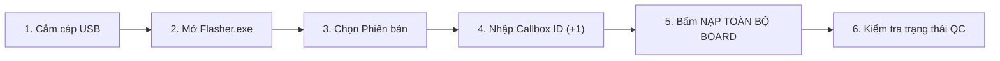
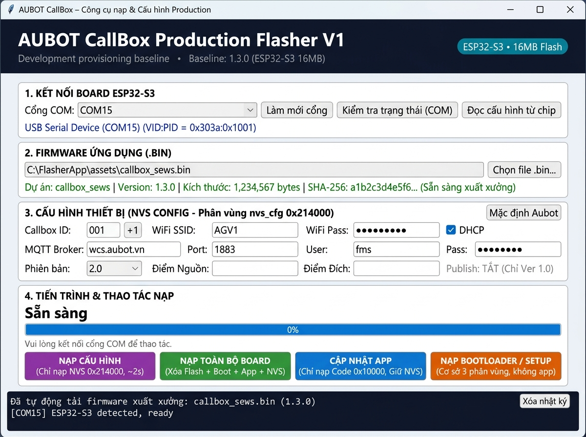
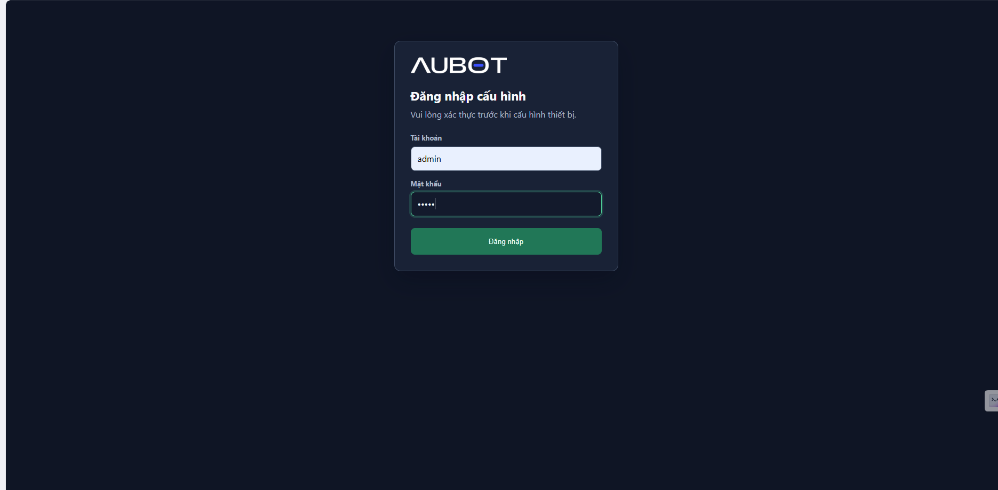
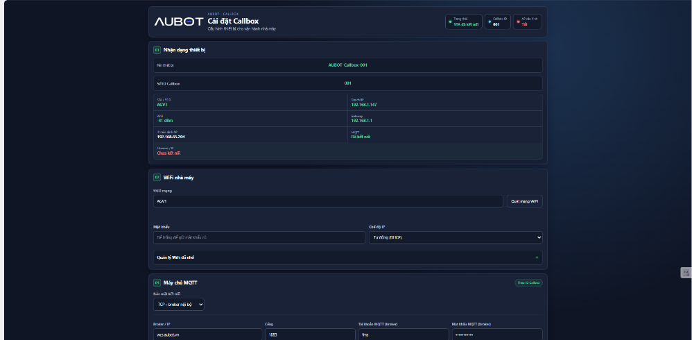
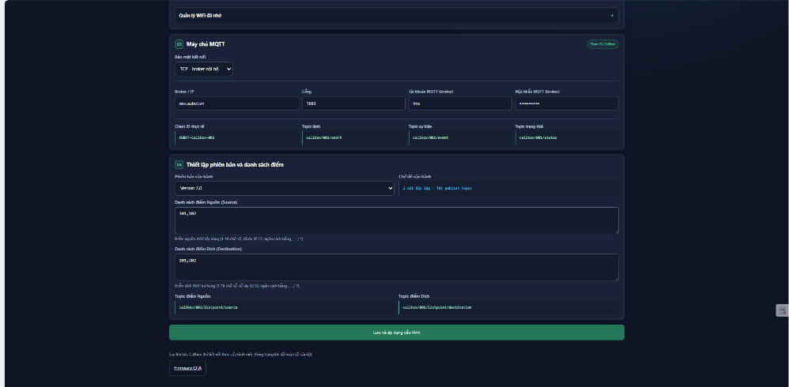
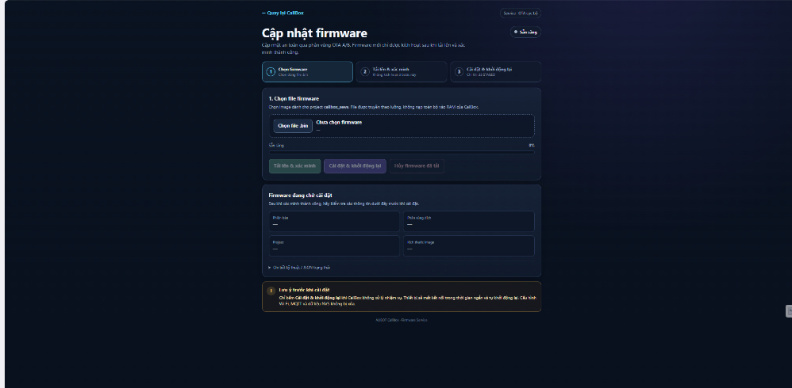
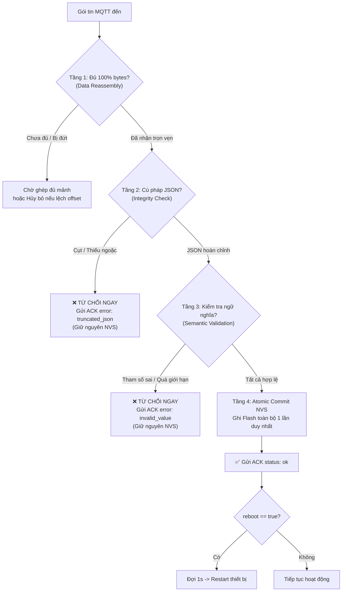

# HƯỚNG DẪN VẬN HÀNH NẠP CODE XUẤT XƯỞNG CALLBOX AUBOT
**Tài liệu quy trình nội bộ dành cho Bộ phận Sản xuất & Kỹ thuật Nhà máy**

---

## 1. Mục đích & Phạm vi áp dụng
* **Mục đích:** Chuẩn hóa quy trình nạp phần mềm, cấu hình thông số nhận diện và kiểm tra chất lượng (QC) cho bo mạch Callbox trước khi đóng hộp xuất xưởng.
* **Đối tượng:** Kỹ thuật viên sản xuất tại xưởng lắp ráp.
* **Công cụ sử dụng:** File chạy độc lập `CallBox-Flasher.exe` (không cần cài đặt Python, ESP-IDF hay driver phức tạp).

---

## 2. Chuẩn bị trước khi nạp
1. **Phần cứng:**
   - Bo mạch điều khiển Callbox (Waveshare ESP32-S3-POE-ETH-8DI-8DO).
   - Cáp USB Type-C **truyền dữ liệu tốt** (lưu ý: không dùng cáp chỉ có chức năng sạc nguồn).
   - Máy tính Windows 10/11 x64 tại bàn nạp xưởng.
2. **Phần mềm:**
   - Tập tin `CallBox-Flasher.exe` đã tích hợp sẵn toàn bộ firmware v1.3.1 và bootloader chuẩn.

---

## 3. Quy trình nạp xuất xưởng (5 Bước chuẩn)



### Bước 1: Kết nối thiết bị
* Cắm đầu cáp USB Type-C vào cổng nạp của Callbox và cắm đầu còn lại vào cổng USB máy tính.
* Đèn nguồn trên bo mạch sáng đỏ/xanh ổn định.

### Bước 2: Khởi động công cụ Flasher
* Nhấp đúp mở `CallBox-Flasher.exe`.
* Công cụ tự động:
  * Nhận diện cổng COM (ví dụ: `COM15 - USB Serial Device`).
  * Tải sẵn firmware xuất xưởng chính thức v1.3.1 (dòng trạng thái báo xanh: `Dự án: callbox_sews | Sẵn sàng xuất xưởng`).

**Giao diện công cụ Flasher (sau khi mở):**



### Bước 3: Lựa chọn Phiên bản xuất xưởng (Operating Version)
Tùy theo lệnh sản xuất / yêu cầu của dự án, chọn tại ô **"Phiên bản"**:

| Phiên bản chọn | Mục đích sử dụng | Hành vi hệ thống tự động |
|---|---|---|
| **Version 2.0** *(Mặc định)* | **Dự án AGV/AMR Aubot chuẩn mới** | Hệ thống Fleet/WCS tự động điều phối xe theo **Callbox ID + Version 2.0**. Điểm Callbox không cần cấu hình danh sách nguồn/đích thủ công nhiều lần. |
| **Version 1.0** | **Dự án tương thích trạm Panasonic / Trạm cố định** | Chế độ 1 nút bấm (gửi Task 1). WCS nhận diện để điều phối trạm cố định. |
| **No version** | **Dự án độc lập / Chế độ I/O thuần túy** | Thiết bị hoạt động nhận gửi tín hiệu I/O độc lập, không qua máy chủ WCS. |

> [!NOTE]
> **Điểm nguồn / Điểm đích:** Đã được loại bỏ hoàn toàn khỏi giao diện nạp và WebUI. Đội WCS/IT phía server sẽ tự động nhận diện theo Callbox ID và Version để điều phối xe, giúp giảm thiểu thời gian cài đặt tại hiện trường.

### Bước 4: Đặt Callbox ID (Số thứ tự thiết bị)
* Nhập mã định danh của Callbox (ví dụ: `001`, `002`...).
* **Mẹo tăng tốc sản xuất:** Khi nạp liên tiếp nhiều thiết bị trong cùng lô, chỉ cần bấm nút **`[+1]`** cạnh ô ID để tự động tăng số thứ tự (`001` $\rightarrow$ `002` $\rightarrow$ `003`...) mà không cần xóa gõ lại.

### Bước 5: Thực hiện nạp
* **Đối với Board mới sản xuất lần đầu:**
  1. Bấm nút màu xanh lá: **`NẠP TOÀN BỘ BOARD`**.
  2. Bảng xác nhận hiện ra: Kỹ thuật viên đối chiếu lại Cổng COM, Callbox ID và Phiên bản xuất xưởng.
  3. Bấm **Yes** để bắt đầu.
  4. Chờ thanh tiến trình chạy qua các bước: *Xóa flash $\rightarrow$ Nạp bootloader $\rightarrow$ Nạp firmware $\rightarrow$ Nạp cấu hình $\rightarrow$ Xác minh*.
  5. Khi hoàn tất, thanh tiến trình báo xanh: **`NẠP THÀNH CÔNG`** (thời gian khoảng 15 giây).
* **Đối với Board đã nạp code, chỉ cần đổi ID hoặc đổi Phiên bản:**
  1. Bấm nút màu tím: **`NẠP CẤU HÌNH`**.
  2. Thời gian nạp chỉ mất **~1-2 giây**.

---

## 4. Nghiệm thu chất lượng xuất xưởng (QC Checklist)

Sau khi nạp thành công, kỹ thuật viên thực hiện kiểm tra nhanh ngay trên tool:
1. Bấm nút **`Kiểm tra trạng thái (COM)`**.
2. Quan sát dòng trạng thái live:
   * 🟢 **WiFi STA:** Hiển thị IP đã nhận từ mạng xưởng (hoặc trạng thái chờ kết nối).
   * 🟢 **MQTT:** Đã kết nối máy chủ WCS (`wcs.aubot.vn`).
   * **ID & Version:** Hiển thị đúng mã Callbox ID và Version vừa nạp.
3. Nếu tất cả thông số chính xác: Dán tem niêm phong / tem ID lên vỏ hộp và chuyển sang khâu đóng gói.

> **Cấu hình nâng cao qua WebUI:** Kỹ thuật viên có thể truy cập trang cấu hình từ điện thoại/máy tính bằng cách kết nối vào WiFi của nhà máy (khi Callbox đã kết nối STA) rồi mở trình duyệt vào địa chỉ IP của Callbox, hoặc kết nối AP cấu hình `http://192.168.65.204/`. Đăng nhập bằng tài khoản `admin` / mật khẩu `aubot`.

**① Trang đăng nhập WebUI:**



**② Giao diện cấu hình — Nhận dạng thiết bị & WiFi nhà máy:**



**③ Giao diện cấu hình — MQTT & Phiên bản vận hành:**



**④ Trang cập nhật firmware OTA (`/ota`):**



---

## 5. Hướng dẫn xử lý sự cố tại xưởng (Troubleshooting)

| Hiện tượng | Nguyên nhân | Cách xử lý |
|---|---|---|
| **Không thấy cổng COM nào xuất hiện** | Cáp USB hỏng hoặc cáp sạc nguồn không có dây data; chưa cắm chặt cổng Type-C. | Thay cáp USB Type-C khác (đảm bảo cáp truyền dữ liệu); cắm lại dứt khoát. Bấm **Làm mới cổng**. |
| **Báo lỗi: "Cổng COM đang bận (Port busy)"** | Đang mở phần mềm khác chiếm cổng (Serial Monitor, VS Code, Putty...). | Tắt các phần mềm đang mở cổng Serial rồi bấm thử lại. |
| **Báo lỗi: "Connecting timeout" khi bắt đầu nạp** | Chip ESP32-S3 đang bận thực thi luồng boot cũ, chưa vào chế độ Download mode. | Giữ nút **BOOT** trên bo mạch $\rightarrow$ bấm nhả nút **RESET** $\rightarrow$ thả nút **BOOT** $\rightarrow$ bấm nạp lại trên tool. |
| **Bị mất điện hoặc tuột cáp giữa chừng** | Bộ nhớ Flash bị xóa dở dang, chip chưa có bootloader hoàn chỉnh. | Cắm lại cáp USB, mở lại tool và bấm **`NẠP TOÀN BỘ BOARD`** để nạp lại từ đầu. |

---

## 6. Hướng dẫn cấu hình từ xa qua MQTT (Tab 2: Cấu hình từ xa)

Dành cho trường hợp thiết bị Callbox **đã xuất xưởng và lắp đặt trên hiện trường/nhà máy**, cần thay đổi thông số (đổi Version 1.0/2.0, đổi WiFi, đổi Broker, đổi Callbox ID) mà **không cần tháo hộp cắm cáp USB**.

### 6.1. Thao tác trên phần mềm CallBox Flasher
1. Mở `CallBox-Flasher.exe`, nhấp chọn tab **`🌐 Cấu hình từ xa (MQTT)`**.
2. **Kết nối Broker:**
   - Nhập thông tin MQTT Broker của nhà máy (mặc định: `wcs.aubot.vn`, Port: `1883`, Tài khoản: `fms`).
   - Bấm nút **`Kết nối Broker`**. Khi kết nối thành công, đèn trạng thái chuyển sang màu xanh lá: `● Đã kết nối`.
3. **Nhập cấu hình cần thay đổi:**
   - **Callbox ID mục tiêu (*):** Nhập ID của thiết bị đang online cần cấu hình (ví dụ: `001`).
   - Chọn các trường cần cập nhật (chế độ **Partial Update** — chỉ trường nào có nhập giá trị mới được gửi đi, các trường để trống sẽ được giữ nguyên vẹn trên chip):
     - *Phiên bản vận hành:* Chọn `2.0`, `1.0` hoặc `No version`.
     - *Đổi Callbox ID mới:* Điền ID mới nếu cần đổi số thiết bị.
     - *Wi-Fi SSID / Mật khẩu mới:* Điền nếu cần chuyển trạm Callbox sang mạng WiFi khác.
     - *Khởi động lại sau khi lưu (Reboot):* Tích chọn để Callbox tự khởi động lại áp dụng ngay.
4. **Gửi lệnh:**
   - Bấm nút: **`🚀 GỬI CẤU HÌNH QUA MQTT (callbox/<ID>/cmd)`**.
   - Xác nhận hộp thoại thông báo.
   - Quan sát trạng thái: Khi Callbox nhận được và lưu NVS thành công, thanh trạng thái và khung log sẽ hiển thị ngay lập tức:
     `✅ THÀNH CÔNG: Callbox 001 đã nhận và lưu cấu hình vào NVS!`

### 6.2. Tập lệnh đặc biệt dành cho Đội IT / Hệ thống WCS
Hệ thống WCS hoặc công cụ tự động của IT có thể gửi lệnh trực tiếp tới topic điều khiển của Callbox:

* **Topic gửi lệnh:** `callbox/<CALLBOX_ID>/cmd` (QoS 1)
* **Topic nhận phản hồi (ACK):** `callbox/<CALLBOX_ID>/event` (QoS 1)

**Cấu trúc bản tin JSON lệnh (`remote_config`):**
```json
{
  "type": "remote_config",
  "operating_version": "2.0",
  "callbox_id": "002",
  "wifi_ssid": "FACTORY_WIFI_NEW",
  "wifi_pass": "Factory@Pass2026",
  "mqtt_broker": "wcs.aubot.vn",
  "mqtt_port": 1883,
  "mqtt_user": "fms",
  "mqtt_pass": "Aubot@2025",
  "reboot": true
}
```

**Bảng chi tiết các trường dữ liệu (Partial Update — chỉ gửi trường cần đổi):**

| Trường | Kiểu dữ liệu | Bắt buộc | Quy tắc xác thực chặt chẽ | Ý nghĩa |
|---|---|---|---|---|
| `type` | String | **Có** | Phải là `"remote_config"` | Nhận diện lệnh cấu hình từ xa |
| `operating_version` | String | Không | Chỉ chấp nhận: `"1.0"`, `"2.0"`, `"No version"` | Phiên bản vận hành (1 nút / 2 nút) |
| `callbox_id` | String | Không | Độ dài 1–15 ký tự, chữ/số, `-`, `_` | Đổi mã định danh thiết bị |
| `wifi_ssid` | String | Không | Độ dài 1–32 ký tự | Tên mạng Wi-Fi nhà máy |
| `wifi_pass` | String | Không | Độ dài 0–64 ký tự | Mật khẩu Wi-Fi |
| `mqtt_broker` | String | Không | Độ dài 1–63 ký tự, không rỗng | Địa chỉ máy chủ MQTT Broker |
| `mqtt_port` | Integer | Không | Giá trị số từ `1` đến `65535` | Cổng kết nối MQTT |
| `mqtt_user` | String | Không | Độ dài 0–31 ký tự | Tài khoản MQTT |
| `mqtt_pass` | String | Không | Độ dài 0–31 ký tự | Mật khẩu MQTT |
| `reboot` | Boolean | Không | `true` hoặc `false` | Khởi động lại sau khi lưu thành công |

**Bản tin phản hồi ACK từ Callbox (`callbox/<CALLBOX_ID>/event`):**

* **Khi thành công:**
```json
{"type": "config_ack", "status": "ok"}
```
*(Nếu `reboot: true`, Callbox sẽ gửi ACK trước, chờ 1 giây rồi tự động khởi động lại).*

* **Khi có lỗi (bị từ chối an toàn):**
```json
{"type": "config_ack", "status": "error", "reason": "<mã_lỗi>"}
```
*Các mã lỗi chuẩn:*
- `truncated_or_malformed_json`: Bản tin bị đứt gãy mạng, cụt chuỗi hoặc sai cú pháp JSON.
- `invalid_operating_version_value`: Phiên bản gửi lên sai quy cách (khác "1.0", "2.0", "No version").
- `invalid_callbox_id_characters` / `invalid_callbox_id_length`: ID chứa ký tự cấm hoặc độ dài vượt mức.
- `invalid_mqtt_port_range`: Cổng MQTT nằm ngoài khoảng 1–65535.
- `invalid_wifi_ssid_length` / `invalid_mqtt_broker_length`: SSID hoặc Broker rỗng / quá dài.
- `nvs_save_failed`: Lỗi ghi phần cứng Flash NVS.

---

### 6.3. Cơ chế bảo vệ nguyên tử & Chống lỗi khi nhận dở dang (Atomic & Integrity Validation)

> [!IMPORTANT]
> **Cam kết an toàn tuyệt đối:** Callbox **CHỈ** thay đổi cấu hình và ghi Flash khi bản tin được nhận xong **đầy đủ 100%** và vượt qua toàn bộ các bước kiểm tra hợp lệ nghiêm ngặt. Nếu quá trình truyền bị chập chờn, rớt mạng hoặc gói tin bị cụt, Callbox **giữ nguyên 100% cấu hình cũ**, không bao giờ bị brick hay mất kết nối.

Quy trình bảo vệ 4 tầng được firmware thực thi tự động:



1. **Tầng 1 — Ghép mảnh gói tin (MQTT Packet Reassembly):**
   - Firmware giám sát `current_data_offset` và `total_data_len` từ driver MQTT.
   - Nếu gói tin TCP/MQTT bị chia nhỏ thành nhiều mảnh (fragments), firmware tích lũy vào bộ đệm nội bộ (`s_cmd_rx_buf`).
   - Lệnh chỉ được chuyển lên bộ xử lý khi và chỉ khi `s_cmd_rx_accum == s_cmd_rx_total` (100% số byte đã tới).
2. **Tầng 2 — Kiểm tra tính toàn vẹn cú pháp JSON (Integrity & Boundary Check):**
   - Quét từ đầu `{` đến ký tự cuối `}`.
   - Kiểm tra cân bằng tuyệt đối các cặp ngoặc nhọn `{}` và ngoặc vuông `[]`.
   - Kiểm tra mọi chuỗi ký tự đều phải có dấu ngoặc kép đóng `"` hợp lệ (hỗ trợ xử lý ký tự escape `\`).
   - Nếu bản tin bị đứt ngang xương (ví dụ: `{"type":"remote_config","callbox_id":`), hệ thống phát hiện ngay là bị cắt cụt $\rightarrow$ Từ chối tức thì, không xử lý dở dang.
3. **Tầng 3 — Xác thực từng trường dữ liệu (Strict Semantic Domain Validation):**
   - Kiểm tra độc lập từng trường có mặt trong payload.
   - Nếu có bất kỳ trường nào sai định dạng, giá trị bất hợp lý (ví dụ: port 99999, version "3.5", id chứa dấu cách), toàn bộ giao dịch bị hủy bỏ ngay lập tức.
4. **Tầng 4 — Cập nhật nguyên tử (Atomic Commit):**
   - Firmware nạp bản sao cấu hình hiện tại từ Flash NVS vào RAM (`new_cfg`).
   - Chỉ ghi đè các trường đã được xác thực thành công.
   - Thực hiện ghi Flash một lần duy nhất (`callbox_config_store_save`).
   - Nếu ghi Flash thất bại, hệ thống gửi thông báo lỗi chi tiết về WCS qua topic `event`.

> **Remote config:** Operating Version được áp dụng transaction-safe vào runtime + NVS. Với CallBox ID/Wi-Fi/MQTT, `reboot=false` nghĩa là cấu hình đã lưu NVS nhưng transport/identity đang chạy có thể chỉ áp dụng đầy đủ sau reboot; Production Flasher mặc định `reboot=true`.


## OTA cục bộ - firmware v1.3.1

- Normal OTA được phép khi `COMM_READY` hoặc `COMM_SYNCING`, với điều kiện Task 1 và Task 2 đang `IDLE`, không có CALL pending và không có CANCEL pending.
- `COMM_OFFLINE` bị chặn trong normal OTA. Recovery OTA vẫn theo policy local/authenticated riêng.
- Khi `COMM_SYNCING`, đèn tháp hiển thị Vàng sáng liên tục kết hợp Đỏ nháy kép (180 ms ON / 180 ms OFF / 180 ms ON / nghỉ khoảng 1 s, lặp lại).
- CallBox không cấu hình Source/Destination; phía WCS/IT tự ánh xạ nghiệp vụ từ CallBox ID + Operating Version + Task.
